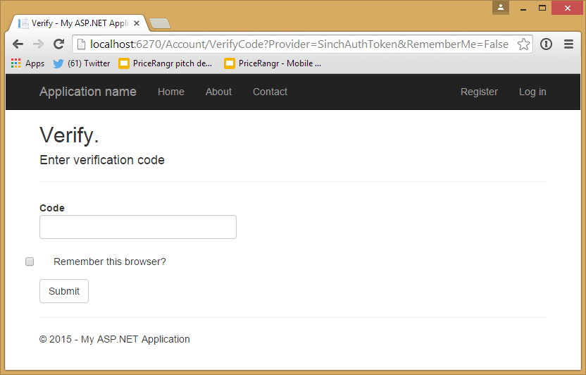

# Part 4: Number verification - Build your own Authenticator app with Sinch and OTP-Sharp

In previous tutorials I showed you how easy it is to verify numbers and use two factor auth on both web and on a iOS device. In this tutorial we are going to build a two factor auth system that that only sends one SMS per app install to enable two factor auth for web, think Microsoft and Google Authenticator or BankId or even facebook login on iOS. The reason for building such a system is that 1. you save money on your two factor auth by eliminating SMS on every single login. Another compelling reason is that you can drive downloads to you app by making it super simple and quick to login to you app. See flow below. This tutorial is implementing the RFC 6238 that Google Authenticator uses.  

The goal is that you will have a template project using Sinch for SMS and sms less 2FA that you can use in production for you website. 

This tutorial will take 60-90 minutes to finish, the finished sample can be downloaded here http://github.com/sinch/sldkafjlaksdjfksldfj

## Appflow


Prerequisites
1. Good knowledge about .net, MVC and WebAPI

## Setup
1. Create a new a project and 
2. Select MVC project with basic Authentication and WebAPI

3. In PM console, update your packages `pm>update-package`
4. In PM Console install Sinch.SMS `pm>Install-Package Sinch.SMS`
5. In PM Console install OTPSharp `pm>Install-Package OtpSharp` 

## Modifying ApplicationUser class
In this tutorial we are going to add a custom TwoFactor Auth provider that is based on IUserTokenProvider. But First we want to add some properties to the Applicationuser object.
First in PM console run Ènable-Migrations` and add below to ApplicationUser 

```csharp
public bool IsSinchAuthEnabled { get; set; }
public string SinchAuthSecretKey { get; set; }

```
In package manager console, run `update-datbase`


## Implementing your own TokenProvider
Create a new class and name it SinchAuthTokenProvider 
```csharp
public class SinchAuthTokenProvider 
: IUserTokenProvider<ApplicationUser, string>
{
    public Task<string> GenerateAsync(string purpose, UserManager<ApplicationUser, string> manager, ApplicationUser user)
    {
        return Task.FromResult((string)null);
    }

    public Task<bool> ValidateAsync(string purpose, string token, UserManager<ApplicationUser, string> manager, ApplicationUser user)
    {
        long timeStepMatched = 0;

        var otp = new Totp(Base32Encoder.Decode(user.SinchAuthSecretKey));
        bool valid = otp.VerifyTotp(token, out timeStepMatched, new VerificationWindow(2, 2));

        return Task.FromResult(valid);
    }

    public Task NotifyAsync(string token, UserManager<ApplicationUser, string> manager, ApplicationUser user)
    {
        return Task.FromResult(true);
    }

    public Task<bool> IsValidProviderForUserAsync(UserManager<ApplicationUser, string> manager, ApplicationUser user)
    {
        return Task.FromResult(user.IsSinchAuthEnabled);
    }
}
```

In the code above, we dont need to implement the GenerateAsync since that will be provided by a service when you verify your phonenumber later on. NotifyAsync will be implemented later to send a push to the user in the app urging them to launch the app.

## Register a new 2FA provider
Open **App_Start\IdentityConfig.cs** comment out SMS and email token providers and add SinchAuth

```csharp
// Register two factor authentication providers. This application uses Phone and Emails as a step of receiving a code for verifying the user
// You can write your own provider and plug it in here.
//manager.RegisterTwoFactorProvider("Phone Code", new PhoneNumberTokenProvider<ApplicationUser>
//{
//    MessageFormat = "Your security code is {0}"
//});
//manager.RegisterTwoFactorProvider("Email Code", new EmailTokenProvider<ApplicationUser>
//{
//    Subject = "Security Code",
//    BodyFormat = "Your security code is {0}"
//});
manager.RegisterTwoFactorProvider("SinchAuthToken", new SinchAuthTokenProvider());
```

##Enabling SMS code to be sent out when phone is Added to the account
Find SMSService in **IdentityConfig.cs**
```csharp
public class SmsService : IIdentityMessageService {
	public Task SendAsync(IdentityMessage message) {
	    Sinch.SMS.Client client = new Client("key", "secret");
	    return client.SendSMS(message.Destination, message.Body);
	}
}
```
Change the key and secret to the key you have in your [dashboard](http://sinch.com/dashboard)

## Adding UI to let the user select to use SinchAuth 
Open the user management index view (**Views\Manage\Index.cshtml**) 
remove the comments around Two factor auth and make it look like below, also uncomment the Phonenumber field since we will use Phonenumber to identify a user.


```html
<dt>Two-Factor Authentication:</dt>
<dd>
    @if (Model.TwoFactor)
        {
            using (Html.BeginForm("DisableTwoFactorAuthentication", "Manage", FormMethod.Post, new { @class = "form-horizontal", role = "form" }))
            {
                @Html.AntiForgeryToken()
                <text>Enabled
                <input type="submit" value="Disable" class="btn btn-link" />
                </text>
            }
        }
        else
        {
            using (Html.BeginForm("EnableTwoFactorAuthentication", "Manage", FormMethod.Post, new { @class = "form-horizontal", role = "form" }))
            {
                @Html.AntiForgeryToken()
                <text>Disabled
                <input type="submit" value="Enable" class="btn btn-link" />
                </text>
            }
        }
</dd>

```

Change **EnableTwoFactorAuthentication** action to look like this 

```csharp
[HttpPost]
[ValidateAntiForgeryToken]
public async Task<ActionResult> EnableTwoFactorAuthentication()
{
    await UserManager.SetTwoFactorEnabledAsync(User.Identity.GetUserId(), true);
    var user = await UserManager.FindByIdAsync(User.Identity.GetUserId());
    if (user != null)
    {
        user.IsSinchAuthEnabled = true;
		byte[] secretKey = 
			KeyGeneration.GenerateRandomKey(OtpHashMode.Sha512);
		user.SinchAuthSecretKey = Base32Encoder.Encode(secretKey);
        await UserManager.UpdateAsync(user);

        await SignInManager.SignInAsync(user, isPersistent: false, rememberBrowser: false);
    }
    return RedirectToAction("Index", "Manage");
}
```
This will set the sinchauth to be true, and add the key that the phone later will get. 
Change **DisableTwoFactorAuthentication** action to below
  
```csharp
[HttpPost]
[ValidateAntiForgeryToken]
public async Task<ActionResult> DisableTwoFactorAuthentication()
{
    await UserManager.SetTwoFactorEnabledAsync(User.Identity.GetUserId(), false);
    var user = await UserManager.FindByIdAsync(User.Identity.GetUserId());
    if (user != null) {
        user.IsSinchAuthEnabled = false;
        user.SinchAuthSecretKey = null;
        await SignInManager.SignInAsync(user, isPersistent: false, rememberBrowser: false);
    }
    return RedirectToAction("Index", "Manage");
}
```

## Run it
Run the application by pressing **F5**, and log in again you should now be presented with this
 
press next and get this
 

Thats not so cool, and in this sample we are only going to support one so as soon as someone tries to login I want to skip directly to verify code. But first lets prepare a api to handle the mobile client 

## Adding API endpoints to verify phone and tokens
As I said before we are going to very the number twice in app, just to make sure the user is in possession of the sim card both times since it might no happen on even the same day. (If you are to use WebAPI for the restof your project you should really add WebAPI secuirty to the whole you web api, read more [http://www.asp.net/web-api/overview/security/individual-accounts-in-web-api](http://www.asp.net/web-api/overview/security/individual-accounts-in-web-api)). 

Create a WebApi controller and name it VerifyController and lets add some plumbing code for Asp.Net identity and a respone object for when you verified a code. 

```csharp
public class VerifyController : ApiController {
    private ApplicationSignInManager _signInManager;
    private ApplicationUserManager _userManager;
    public VerifyController(ApplicationUserManager userManager, ApplicationSignInManager signInManager) {
        UserManager = userManager;
        SignInManager = signInManager;
    }
    public ApplicationSignInManager SignInManager {
        get
        {
            return _signInManager ?? Request.GetOwinContext().Get<ApplicationSignInManager>();
        }
        private set {
            _signInManager = value;
        }
    }
    public ApplicationUserManager UserManager {
        get
        {
            return _userManager ?? Request.GetOwinContext().GetUserManager<ApplicationUserManager>();
        }
        private set {
            _userManager = value;
        }
    }
    
    /// <summary>
    /// Method to start a phonenumber verification process. 
    /// </summary>
    /// <param name="phoneNumber">Phonenumber in international format 15555551231</param>
    /// <returns>200 ok and delivers an sms to the handset</returns>
    [HttpGet]
	[Route("/api/requestcode/{phonenumber}")]
    public async Task<HttpResponseMessage> RequestCode(string phoneNumber){    
    }

    /// <summary>
    /// Endpoint for verifying code recieved by sms
    /// </summary>
    /// <param name="phoneNumber">Phonenumber in international format 15555551231</param>
    /// <param name="code">code</param>
    /// <returns>object with a VerifyCodeResponse</returns>
    [HttpGet]
    [Route("/api/verifycode/{phonenumber}/{code}")]
    public async Task<VerifyCodeResponse> VerifyCode(string phoneNumber, string code) {
    }

    /// <summary>
    /// Use this to send in the RFC token from the authenticator funtion in the app
    /// </summary>
    /// <param name="token"></param>
    /// <param name="phoneNumber"></param>
    /// <returns></returns>
    [HttpPost]
    [Route("/api/token/")]
    public async Task<HttpResponseMessage> VerifyToken(string token, string phoneNumber)
    {
        return null;
    }
}

public class VerifyCodeResponse
{
    [JsonProperty(PropertyName = "secret")]
    public string Secret { get; set; }
}
```

Lets implement the avove methods, and go thru them one by one, lets start with **ReqeustCode** wich will be the first step in the number verification process. 

```csharp
public async Task<HttpResponseMessage> RequestCode(string phoneNumber) {
    var number = phoneNumber.Trim();
    var user = UserManager.Users.First(u => u.PhoneNumber == phoneNumber);
	if (user == null)
    	throw new HttpException(404, "User not found");
	//Take advantage of the ASP.net Identity to send SMS 
    await UserManager.GenerateChangePhoneNumberTokenAsync(user.Id, number); 
    return new HttpResponseMessage(HttpStatusCode.OK);
}
```

Next lets implement the method to verify the code sent by sms and return the secret to the to client.  
 
```csharp
public async Task<VerifyCodeResponse> VerifyCode(string phoneNumber, string code) {
    var user = UserManager.Users.FirstOrDefault(u => u.PhoneNumber == phoneNumber);
	if (user == null)
    	throw new HttpException(404, "User not found");
    VerifyCodeResponse vcr = new VerifyCodeResponse();
    var result = await UserManager.VerifyChangePhoneNumberTokenAsync(user.Id, phoneNumber, code);
    if (result)
    {
        vcr.Secret = user.SinchAuthSecretKey;
    }
    return vcr;
}
```

Last we need to implement the method where we will verify a generated token from the handset.
For this phase because we are not verifying the code from the browswer we are going to generate a one time link for the browswer to login once the code is verified. 

```csharp
public class OneTimeLink {
    public string UserId { get; set; }
    public Guid Guid { get; set; }
}

public class OneTimeLinks {
    private static List<OneTimeLink> _oneTimelinks { get; set; }

    public static OneTimeLink GetByUserId(string userId) {
		if (_oneTimelinks == null)
			return null;
        return _oneTimelinks.FirstOrDefault(m => m.UserId == userId);
    }
    public static bool VerifyLink(string userId, Guid guid) {
		if (_oneTimelinks == null)
			return false;
        if (_oneTimelinks.Any(m => m.Guid == guid && m.UserId == userId)) {
			//if it checked out remove the link its now not valid anymore
            _oneTimelinks.Remove(_oneTimelinks.First(m => m.Guid == guid && m.UserId == userId));
            return true;
        } else {
            return false;
        }
    }
    public static void AddLink(string userId) {
        if (_oneTimelinks == null)
            _oneTimelinks = new List<OneTimeLink>();
        _oneTimelinks.Add(new OneTimeLink {
            UserId = userId,
            Guid = Guid.NewGuid()
        });
    }
}
```

The way we are going to use above code is to add a an entry to the list once a TOPT token is verifyied  

```csharp
[HttpPost]
[Route("api/verifytoken/")]
public async Task<HttpResponseMessage> VerifyToken(string token, string phoneNumber)
{
    long timeStepMatched = 0;
    var user = UserManager.Users.First(u => u.PhoneNumber == phoneNumber);
    var otp = new Totp(Base32Encoder.Decode(user.SinchAuthSecretKey));
    bool valid = otp.VerifyTotp(token, out timeStepMatched, new VerificationWindow(2, 2));
    if (!valid) // return error if token is invalid
        return new HttpResponseMessage(HttpStatusCode.Forbidden);
	//Add link and return ok to the client    
	OneTimeLinks.AddLink(user.Id);
    return new HttpResponseMessage(HttpStatusCode.OK);
}
```

Last lets add an enpoint to check for links for the webclient to the verifycontroller, later will use this to see if we want to try and authenticate user and guid.

```csharp
[HttpGet]
[Route("Verify/StatusCheck")]
public async Task<object> StatusCheck()
{
    var userId = await SignInManager.GetVerifiedUserIdAsync();
    if (string.IsNullOrEmpty(userId))
    {
        return Json(new {status="Error"});
    }
    var link = OneTimeLinks.GetByUserId(userId);
    if ( link == null) {
        return Json(new {status="Waiting"});
        }
    else
    {
    return Json(new {status="Ok", guid=link.Guid});    
    }
}
```


## Change the UI of the 2FA
Next up it to change the flow of the UI reflect that no code will be entered in the webui, but rather just continue to a logged in state as soon as you verified an TOTP code.   

Open up AccountController and change below methods.

Change SendCode(string returnUrl, bool RememberMe) to below
```csharp
[AllowAnonymous]
public async Task<ActionResult> SendCode(string returnUrl, bool rememberMe)
{
    var userId = await SignInManager.GetVerifiedUserIdAsync();
    if (userId == null)
    {
        return View("Error");
    }
    return View();
}
```
We want the check status of the OTP in the view so open SendCode.cshtml and change it to below adn prompt the user to launch the mobile app and enter code. 

```html
@model Part4.Models.SendCodeViewModel
@{
    ViewBag.Title = "Send";
}
<h2>@ViewBag.Title.</h2>
Open you app and generate a verify your identity
@section Scripts {
    <script>
        function checkStatus() {
            $.getJSON('@Url.Action("StatusCheck", "Verify")', function(data) {
                if (data['status'] == 'Ok') {
                    document.location = '@Url.Action("VerifyTOTP")?guid=' + data["guid"] + '&returnUrl=@Model.ReturnUrl';
                } else {
                    setTimeout(checkStatus, 1000);
                }
            });
        }
        $().ready(function() {
            checkStatus();
        });
    </script>
}
```
What we are doing here is to check for status if there has been a onetime link added to the list, if that is the case, redirect to a new location and verifies the guid and user id and signin.

Open AccountController and add the VerifyOTP action

```csharp
 [AllowAnonymous]
public async Task<ActionResult> VerifyTOTP(string guid, string returnUrl)
{
    var userId = await SignInManager.GetVerifiedUserIdAsync();
    
    if (string.IsNullOrEmpty(userId))
    {
        return View("Error");
    }
    if (OneTimeLinks.VerifyLink(userId, Guid.Parse(guid)))
    {
        await SignInManager.SignInAsync(UserManager.FindById(userId), false, false);
        return RedirectToLocal(returnUrl);    
    }
    else
    {
        return View("Error");
    }
}
```

Wow, that was quite some work, now this is a pretty solid solution for you to use to continue to build your website. 

## Wahts next on serverside 
If you like this and would like to use in production I would probably enable oath on webapi since you will most likely use this as your backend for mobile as well. How to do that you can read about here
[http://www.asp.net/web-api/overview/security/individual-accounts-in-web-api](http://www.asp.net/web-api/overview/security/individual-accounts-in-web-api) 

**Ready for more?** Ok, lets build the iOS client that you can use to to login to your service. 

## Building a 2FA TOTP iOS client
In this tutorial, we are verifying the phonenumber twice, once for creating your account and once you install the app. The reason for that is I want to make sure you are in possession of the sim card both times. In subsequent requests no SMS will be sent. The biggest security risk in this solution is that I will send the shared secret over to the device once time. The reason for this is that I didnt want to have to enter any code, or scan a QR code that felt was not a good experience. If you have doubts over sending the key encrypted over the internet once, you could have the user to enter in manually or send the shared secret with SMS and have a url to launch it.    

Much of the TOPT code is from this excelent repo https://github.com/RisingOak/otp-authenticator and I ported it to a framework to suit my flow.

