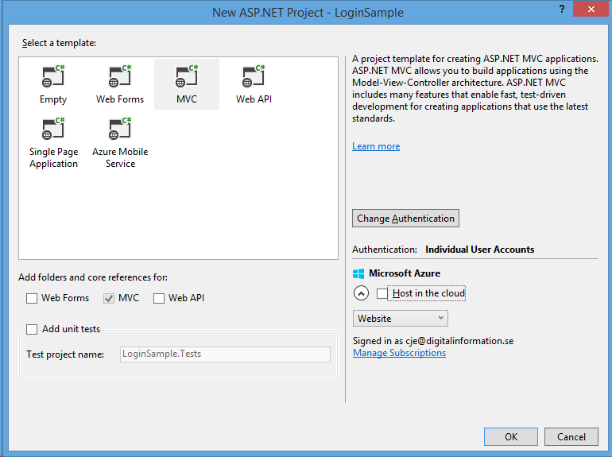

# Part 3 - Number Verification, ASP.NET Identity and Two Factor Authentication 
In this part of the tutorial series, we are going to create an SMS provider for Microsoft Identity that comes shipped with in the .net framework in about 15 minutes.

## Prerequisites 
1. Good understanding of C# and REST APIs
2. Visual Studio 2013 or later
3. An account with Sinch [http://sinch.com/signup](http://sinch.com/signup)

## Setup
1. Create a new a project and name it **LoginSample**
2. Select MVC project with basic Authentication



## Enable SMS for Two Factor Authentication with Sinch
1. In the package manager console, enter `Install-Package Sinch.SMS`
2. Open **IdentityConfig.cs** in the **App_Start** folder and find the **SMSService** class and add the Sinch implementation to it like this:

```csharp
public Task SendAsync(IdentityMessage message)
{
    Sinch.SMS.Client client = new Client("key", "secret");
    return client.SendSMS(message.Destination, message.Body);
}
```

Remember to replace the **key** and **secret** with your own info from the [dashboard](http://sinch.com/dashboard)

## Update the profile page to show number
In a production scenario, you would probably ask for a phone number during the registration process, but in this case we will just add it to the profile page. 

1. Open **Views\Manage\Index.cshtml**, and find the **PhoneNumber** section and uncomment it:

```html
  <dt>Phone Number:</dt>
    <dd>
        @(Model.PhoneNumber ?? "None") [
        @if (Model.PhoneNumber != null)
        {
            @Html.ActionLink("Change", "AddPhoneNumber")
            @: &nbsp;|&nbsp;
            @Html.ActionLink("Remove", "RemovePhoneNumber")
        }
        else
        {
            @Html.ActionLink("Add", "AddPhoneNumber")
        }
        ]
    </dd>
``` 

2. Also uncomment the Two Factor Authenticate part:

```csharp
 @if (Model.TwoFactor)
{
    using (Html.BeginForm("DisableTwoFactorAuthentication", "Manage", FormMethod.Post, new { @class = "form-horizontal", role = "form" }))
    {
        @Html.AntiForgeryToken()
        <text>Enabled
        <input type="submit" value="Disable" class="btn btn-link" />
        </text>
    }
}
else
{
    using (Html.BeginForm("EnableTwoFactorAuthentication", "Manage", FormMethod.Post, new { @class = "form-horizontal", role = "form" }))
    {
        @Html.AntiForgeryToken()
        <text>Disabled
        <input type="submit" value="Enable" class="btn btn-link" />
        </text>
    }
}
```

#Testing the app
Hit **F5** and run the app. If you haven't already registered an account, click on the user name in the top right corner. This will take you to the manage profile page.


1. Click add phone number (remember to enter it in international format i.e **1**5612600684)
2. Enter the code you received in an SMS
3. Click enable Two Factor Auth, and log off and log in again you should now see it below:


4. Click next and enter the code in the next window.


This tutorial showed you how easy it is to enable Two Factor Auth on an ASP.net Identity application using Sinch. 
