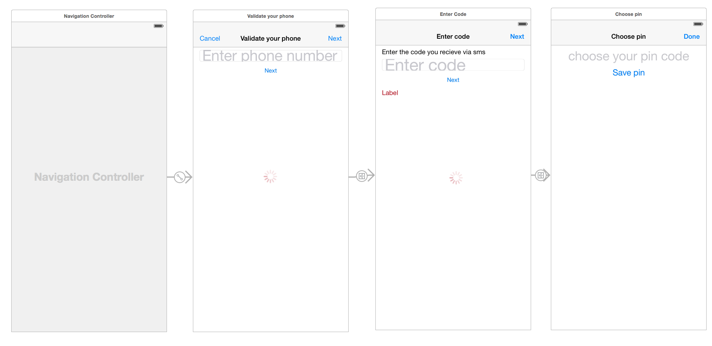

# Part 4: Number verification - Build your own Authenticator app with Sinch and OTP-Sharp

In previous tutorials I showed you how easy it is to verify numbers and use two factor auth on both web and on a iOS device. In this tutorial we are going to build a two factor auth system that that only sends one SMS per app install to enable two factor auth for web, think Microsoft and Google Authenticator or BankId or even facebook login on iOS. The reason for building such a system is that 
1. You save money on your two factor auth by eliminating SMS on every single login. 
2. Drive downloads to your app by making it super simple and quick to login to your service. 

See flow below. This tutorial is implementing the RFC 6238 that Google Authenticator uses.  

## Appflow


The goal is that you will have a template project using Sinch for SMS and SMS free 2FA that you can use in production for you website. 

This tutorial will take 60-120 minutes to finish, the finished sample can be downloaded here http://github.com/sinch/sldkafjlaksdjfksldfj

## Prerequisites
1. Good knowledge about .net, MVC and WebAPI

## Setup
1. Create a new a project and 
2. Select MVC project with basic Authentication and WebAPI

3. In PM console, update your packages `pm>update-package`
4. In PM Console install Sinch.SMS `pm>Install-Package Sinch.SMS`
5. In PM Console install OTPSharp `pm>Install-Package OtpSharp` 

## Modifying ApplicationUser class
In this tutorial we are going to add a custom TwoFactor Auth provider that is based on IUserTokenProvider. But First we want to add some properties to the Applicationuser object.
First in PM console run Ènable-Migrations` and add below to ApplicationUser 

```csharp
public bool IsSinchAuthEnabled { get; set; }
public string SinchAuthSecretKey { get; set; }

```
In package manager console, run `update-datbase`


## Implementing your own TokenProvider
Create a new class and name it SinchAuthTokenProvider 
```csharp
public class SinchAuthTokenProvider 
: IUserTokenProvider<ApplicationUser, string>
{
    public Task<string> GenerateAsync(string purpose, UserManager<ApplicationUser, string> manager, ApplicationUser user)
    {
        return Task.FromResult((string)null);
    }

    public Task<bool> ValidateAsync(string purpose, string token, UserManager<ApplicationUser, string> manager, ApplicationUser user)
    {
        long timeStepMatched = 0;

        var otp = new Totp(Base32Encoder.Decode(user.SinchAuthSecretKey));
        bool valid = otp.VerifyTotp(token, out timeStepMatched, new VerificationWindow(2, 2));

        return Task.FromResult(valid);
    }

    public Task NotifyAsync(string token, UserManager<ApplicationUser, string> manager, ApplicationUser user)
    {
        return Task.FromResult(true);
    }

    public Task<bool> IsValidProviderForUserAsync(UserManager<ApplicationUser, string> manager, ApplicationUser user)
    {
        return Task.FromResult(user.IsSinchAuthEnabled);
    }
}
```

In the code above, we dont need to implement the GenerateAsync since that will be provided by a service when you verify your phonenumber later on. NotifyAsync will be implemented later to send a push to the user in the app urging them to launch the app.

## Register a new 2FA provider
Open **App_Start\IdentityConfig.cs** comment out SMS and email token providers and add SinchAuth

```csharp
// Register two factor authentication providers. This application uses Phone and Emails as a step of receiving a code for verifying the user
// You can write your own provider and plug it in here.
//manager.RegisterTwoFactorProvider("Phone Code", new PhoneNumberTokenProvider<ApplicationUser>
//{
//    MessageFormat = "Your security code is {0}"
//});
//manager.RegisterTwoFactorProvider("Email Code", new EmailTokenProvider<ApplicationUser>
//{
//    Subject = "Security Code",
//    BodyFormat = "Your security code is {0}"
//});
manager.RegisterTwoFactorProvider("SinchAuthToken", new SinchAuthTokenProvider());
```

##Enabling SMS code to be sent out when phone is Added to the account
Find SMSService in **IdentityConfig.cs**
```csharp
public class SmsService : IIdentityMessageService {
	public Task SendAsync(IdentityMessage message) {
	    Sinch.SMS.Client client = new Client("key", "secret");
	    return client.SendSMS(message.Destination, message.Body);
	}
}
```
Change the key and secret to the key you have in your [dashboard](http://sinch.com/dashboard)

## Adding UI to let the user select to use SinchAuth 
Open the user management index view (**Views\Manage\Index.cshtml**) 
remove the comments around Two factor auth and make it look like below, also uncomment the Phonenumber field since we will use Phonenumber to identify a user.


```html
<dt>Two-Factor Authentication:</dt>
<dd>
    @if (Model.TwoFactor)
        {
            using (Html.BeginForm("DisableTwoFactorAuthentication", "Manage", FormMethod.Post, new { @class = "form-horizontal", role = "form" }))
            {
                @Html.AntiForgeryToken()
                <text>Enabled
                <input type="submit" value="Disable" class="btn btn-link" />
                </text>
            }
        }
        else
        {
            using (Html.BeginForm("EnableTwoFactorAuthentication", "Manage", FormMethod.Post, new { @class = "form-horizontal", role = "form" }))
            {
                @Html.AntiForgeryToken()
                <text>Disabled
                <input type="submit" value="Enable" class="btn btn-link" />
                </text>
            }
        }
</dd>

```

Change **EnableTwoFactorAuthentication** action to look like this 

```csharp
[HttpPost]
[ValidateAntiForgeryToken]
public async Task<ActionResult> EnableTwoFactorAuthentication()
{
    await UserManager.SetTwoFactorEnabledAsync(User.Identity.GetUserId(), true);
    var user = await UserManager.FindByIdAsync(User.Identity.GetUserId());
    if (user != null)
    {
        user.IsSinchAuthEnabled = true;
		byte[] secretKey = 
			KeyGeneration.GenerateRandomKey(OtpHashMode.Sha512);
		user.SinchAuthSecretKey = Base32Encoder.Encode(secretKey);
        await UserManager.UpdateAsync(user);

        await SignInManager.SignInAsync(user, isPersistent: false, rememberBrowser: false);
    }
    return RedirectToAction("Index", "Manage");
}
```
This will set the sinchauth to be true, and add the key that the phone later will get. 
Change **DisableTwoFactorAuthentication** action to below
  
```csharp
[HttpPost]
[ValidateAntiForgeryToken]
public async Task<ActionResult> DisableTwoFactorAuthentication()
{
    await UserManager.SetTwoFactorEnabledAsync(User.Identity.GetUserId(), false);
    var user = await UserManager.FindByIdAsync(User.Identity.GetUserId());
    if (user != null) {
        user.IsSinchAuthEnabled = false;
        user.SinchAuthSecretKey = null;
        await SignInManager.SignInAsync(user, isPersistent: false, rememberBrowser: false);
    }
    return RedirectToAction("Index", "Manage");
}
```

## Run it
Run the application by pressing **F5**, and log in again you should now be presented with this
 
press next and get this
 

Thats not so cool, and in this sample we are only going to support one so as soon as someone tries to login I want to skip directly to verify code. But first lets prepare a api to handle the mobile client 

## Adding API endpoints to verify phone and tokens
As I said before we are going to very the number twice in app, just to make sure the user is in possession of the sim card both times since it might no happen on even the same day. (If you are to use WebAPI for the restof your project you should really add WebAPI secuirty to the whole you web api, read more [http://www.asp.net/web-api/overview/security/individual-accounts-in-web-api](http://www.asp.net/web-api/overview/security/individual-accounts-in-web-api)). 

Create a WebApi controller and name it VerifyController and lets add some plumbing code for Asp.Net identity and a respone object for when you verified a code. 

```csharp
public class VerifyController : ApiController {
    private ApplicationSignInManager _signInManager;
    private ApplicationUserManager _userManager;
    public VerifyController(ApplicationUserManager userManager, ApplicationSignInManager signInManager) {
        UserManager = userManager;
        SignInManager = signInManager;
    }
    public ApplicationSignInManager SignInManager {
        get
        {
            return _signInManager ?? Request.GetOwinContext().Get<ApplicationSignInManager>();
        }
        private set {
            _signInManager = value;
        }
    }
    public ApplicationUserManager UserManager {
        get
        {
            return _userManager ?? Request.GetOwinContext().GetUserManager<ApplicationUserManager>();
        }
        private set {
            _userManager = value;
        }
    }
    
    /// <summary>
    /// Method to start a phonenumber verification process. 
    /// </summary>
    /// <param name="phoneNumber">Phonenumber in international format 15555551231</param>
    /// <returns>200 ok and delivers an sms to the handset</returns>
    [HttpGet]
	[Route("/api/requestcode/{phonenumber}")]
    public async Task<HttpResponseMessage> RequestCode(string phoneNumber){    
    }

    /// <summary>
    /// Endpoint for verifying code recieved by sms
    /// </summary>
    /// <param name="phoneNumber">Phonenumber in international format 15555551231</param>
    /// <param name="code">code</param>
    /// <returns>object with a VerifyCodeResponse</returns>
    [HttpGet]
    [Route("/api/verifycode/{phonenumber}/{phoneNumber}/{code}")]
    public async Task<VerifyCodeResponse> VerifyCode(string phoneNumber, string code) {
    }

    /// <summary>
    /// Use this to send in the RFC token from the authenticator funtion in the app
    /// </summary>
    /// <param name="token"></param>
    /// <param name="phoneNumber"></param>
    /// <returns></returns>
    [HttpPost]
    [Route("/api/token/")]
    public async Task<HttpResponseMessage> VerifyToken(string token, string phoneNumber)
    {
        return null;
    }
}

public class VerifyCodeResponse
{
    [JsonProperty(PropertyName = "secret")]
    public string Secret { get; set; }
}
```

Lets implement the avove methods, and go thru them one by one, lets start with **ReqeustCode** wich will be the first step in the number verification process. 

```csharp
[HttpGet]
[Route("api/requestcode/{phonenumber}")]
public async Task<HttpResponseMessage> RequestCode(string phoneNumber) {
    var number = phoneNumber.Trim();
    var user = UserManager.Users.First(u => u.PhoneNumber == phoneNumber);
    var code = await UserManager.GenerateChangePhoneNumberTokenAsync(user.Id, number);
    if (UserManager.SmsService != null)
    {
        var message = new IdentityMessage
        {
            Destination = number,
            Body = "Your security code is: " + code
        };
        await UserManager.SmsService.SendAsync(message);
    }
    return new HttpResponseMessage(HttpStatusCode.OK);
}
```

Next lets implement the method to verify the code sent by sms and return the secret to the to client.  
 
```csharp
public async Task<VerifyCodeResponse> VerifyCode(string phoneNumber, string code) {
    var user = UserManager.Users.FirstOrDefault(u => u.PhoneNumber == phoneNumber);
	if (user == null)
    	throw new HttpException(404, "User not found");
    VerifyCodeResponse vcr = new VerifyCodeResponse();
    var result = await UserManager.VerifyChangePhoneNumberTokenAsync(user.Id, code, phoneNumber);
    if (result)
    {
        vcr.Secret = user.SinchAuthSecretKey;
        return vcr;
    }
    else
    {
		throw new HttpException(404, "Wrong code");
    }
    
}
```

Last we need to implement the method where we will verify a generated token from the handset.
For this phase because we are not verifying the code from the browswer we are going to generate a one time link for the browswer to login once the code is verified. 

```csharp
public class OneTimeLink {
    public string UserId { get; set; }
    public Guid Guid { get; set; }
}

public class OneTimeLinks {
    private static List<OneTimeLink> _oneTimelinks { get; set; }

    public static OneTimeLink GetByUserId(string userId) {
		if (_oneTimelinks == null)
			return null;
        return _oneTimelinks.FirstOrDefault(m => m.UserId == userId);
    }
    public static bool VerifyLink(string userId, Guid guid) {
		if (_oneTimelinks == null)
			return false;
        if (_oneTimelinks.Any(m => m.Guid == guid && m.UserId == userId)) {
			//if it checked out remove the link its now not valid anymore
            _oneTimelinks.Remove(_oneTimelinks.First(m => m.Guid == guid && m.UserId == userId));
            return true;
        } else {
            return false;
        }
    }
    public static void AddLink(string userId) {
        if (_oneTimelinks == null)
            _oneTimelinks = new List<OneTimeLink>();
        _oneTimelinks.Add(new OneTimeLink {
            UserId = userId,
            Guid = Guid.NewGuid()
        });
    }
}
```

The way we are going to use above code is to add a an entry to the list once a TOPT token is verifyied  

```csharp
[HttpPost]
[Route("api/verifytoken/")]
public async Task<HttpResponseMessage> VerifyToken(string token, string phoneNumber)
{
    long timeStepMatched = 0;
    var user = UserManager.Users.First(u => u.PhoneNumber == phoneNumber);
    var otp = new Totp(Base32Encoder.Decode(user.SinchAuthSecretKey));
    bool valid = otp.VerifyTotp(token, out timeStepMatched, new VerificationWindow(2, 2));
    if (!valid) // return error if token is invalid
        return new HttpResponseMessage(HttpStatusCode.Forbidden);
	//Add link and return ok to the client    
	OneTimeLinks.AddLink(user.Id);
    return new HttpResponseMessage(HttpStatusCode.OK);
}
```

Last lets add an enpoint to check for links for the webclient to the verifycontroller, later will use this to see if we want to try and authenticate user and guid.

```csharp
[HttpGet]
[Route("Verify/StatusCheck")]
public async Task<object> StatusCheck()
{
    var userId = await SignInManager.GetVerifiedUserIdAsync();
    if (string.IsNullOrEmpty(userId))
    {
        return Json(new {status="Error"});
    }
    var link = OneTimeLinks.GetByUserId(userId);
    if ( link == null) {
        return Json(new {status="Waiting"});
        }
    else
    {
    return Json(new {status="Ok", guid=link.Guid});    
    }
}
```


## Change the UI of the 2FA
Next up it to change the flow of the UI reflect that no code will be entered in the webui, but rather just continue to a logged in state as soon as you verified an TOTP code.   

Open up AccountController and change below methods.

Change SendCode(string returnUrl, bool RememberMe) to below
```csharp
[AllowAnonymous]
public async Task<ActionResult> SendCode(string returnUrl, bool rememberMe)
{
    var userId = await SignInManager.GetVerifiedUserIdAsync();
    if (userId == null)
    {
        return View("Error");
    }
    return View();
}
```
We want the check status of the OTP in the view so open SendCode.cshtml and change it to below adn prompt the user to launch the mobile app and enter code. 

```html
@model Part4.Models.SendCodeViewModel
@{
    ViewBag.Title = "Send";
}
<h2>@ViewBag.Title.</h2>
Open you app and generate a verify your identity
@section Scripts {
    <script>
        function checkStatus() {
            $.getJSON('@Url.Action("StatusCheck", "Verify")', function(data) {
                if (data['status'] == 'Ok') {
                    document.location = '@Url.Action("VerifyTOTP")?guid=' + data["guid"] + '&returnUrl=@Model.ReturnUrl';
                } else {
                    setTimeout(checkStatus, 1000);
                }
            });
        }
        $().ready(function() {
            checkStatus();
        });
    </script>
}
```
What we are doing here is to check for status if there has been a onetime link added to the list, if that is the case, redirect to a new location and verifies the guid and user id and signin.

Open AccountController and add the VerifyOTP action

```csharp
 [AllowAnonymous]
public async Task<ActionResult> VerifyTOTP(string guid, string returnUrl)
{
    var userId = await SignInManager.GetVerifiedUserIdAsync();
    
    if (string.IsNullOrEmpty(userId))
    {
        return View("Error");
    }
    if (OneTimeLinks.VerifyLink(userId, Guid.Parse(guid)))
    {
        await SignInManager.SignInAsync(UserManager.FindById(userId), false, false);
        return RedirectToLocal(returnUrl);    
    }
    else
    {
        return View("Error");
    }
}
```

Wow, that was quite some work, now this is a pretty solid solution for you to use to continue to build your website. 

## Wahts next on serverside 
If you like this and would like to use in production I would probably enable oath on webapi since you will most likely use this as your backend for mobile as well. How to do that you can read about here
[http://www.asp.net/web-api/overview/security/individual-accounts-in-web-api](http://www.asp.net/web-api/overview/security/individual-accounts-in-web-api) 

**Ready for more?** Ok, lets build the iOS client that you can use to to login to your service. 

## Building a 2FA TOTP iOS client
In this tutorial, we are verifying the phone number twice, once for creating your account and once you install the app. The reason for that is I want to make sure you are in possession of the sim card both times. In subsequent requests no SMS will be sent. The biggest security risk in this solution is that I will send the shared secret over to the device once time. The reason for this is that I didn't want to have to enter any code, or scan a QR code that felt was not a good experience. If you have doubts over sending the key encrypted over the internet once, you could have the user to enter in manually or send the shared secret with SMS and have a url to launch it.    

The generation of the TOPT code is from this excellent repo https://github.com/yazid/iOS-TOTP,  Yazid did a superb job of cleaning out googles sample code that is super bloated.

To get up to speed create new project just like [part 2](https://www.sinch.com/tutorials/build-two-factor-authentication-system-pt-2/) in this tutorial but name it NumberValidatorWithOTP when you are done with that comeback here (or be lazy as me and just copy the repo and name refactor).

## Preparation
If you renamed you project you need to change startValidation method and load the correct bundle.
Change the name of the line
```objectivec
    NSBundle* bundle = [NSBundle  bundleWithIdentifier:@"com.sinch.NumberValidator"]; 
```
to 
```objectivec
    NSBundle* bundle = [NSBundle  bundleWithIdentifier:@"com.sinch.NumberValidatorWithOTP"]; 
```

Next you need to change the methods in HttpClient to reflect your requestCode *("/api/requestcode/{phone number})* and verifyCode *(/api/verifycode/{phoneNumber}/{code})* endpoints from above. 

```objectivec
-(void)requestCode:(NSString *)phoneNumber completion:(void (^)(NSError *))completion
{
    sessionManager = [NSURLSession sharedSession];
    NSString* url = [@"http://yourserver/api/" stringByAppendingString:phoneNumber];
    [[sessionManager downloadTaskWithURL:[NSURL URLWithString:url] completionHandler:^(NSURL *location, NSURLResponse *response, NSError *error) {
        if (completion)
        {
            completion(error);
        }
        
    }] resume];
}

-(void)validateCode:(NSString *)phoneNumber :(NSString *)code completion:(void (^)(NSError *))completion{
    sessionManager = [NSURLSession sharedSession];
    NSString* url = [NSString stringWithFormat:@"http://yourserver/api/verifycode/%@&/%@", phoneNumber, code];
    [[sessionManager downloadTaskWithURL:[NSURL URLWithString:url] completionHandler:^(NSURL *location, NSURLResponse *response, NSError *error) {
        if (completion)
            completion(error);
    }] resume];
}
```

## Let the user choose pin 
We don't want to store a PIN code in NUSUSERDEFAULTS because its a bit insecure, so instead we are going to use apples keychain wrapper to store a both pin code and the  shareSecret, add a file called SimpleKeychain and copy the following in to .h file 

```objectivec
#import <Foundation/Foundation.h>

@class SimpleKeychainUserPass;

@interface SimpleKeychain : NSObject

+ (void)save:(NSString *)service account:(NSString *)account data:(id)data;
+ (id)load:(NSString *)service account:(NSString *)account;
+ (void)delete:(NSString *)service account:(NSString *)account;

@end
```
(source: [btjones at github](https://gist.github.com/btjones/10287581) )

and the implementation
```
+ (NSMutableDictionary *)getKeychainQuery:(NSString *)service account:(NSString *)account {
    return [NSMutableDictionary dictionaryWithObjectsAndKeys:
            (__bridge id)kSecClassGenericPassword, (__bridge id)kSecClass,
            service, (__bridge id)kSecAttrService,
            account, (__bridge id)kSecAttrAccount,
            (__bridge id)kSecAttrAccessibleAfterFirstUnlock, (__bridge id)kSecAttrAccessible,
            nil];
}

+ (void)save:(NSString *)service account:(NSString *)account data:(id)data {
    NSMutableDictionary *keychainQuery = [self getKeychainQuery:service account:account];
    SecItemDelete((__bridge CFDictionaryRef)keychainQuery);
    [keychainQuery setObject:[NSKeyedArchiver archivedDataWithRootObject:data] forKey:(__bridge id)kSecValueData];
    SecItemAdd((__bridge CFDictionaryRef)keychainQuery, NULL);
}

+ (id)load:(NSString *)service account:(NSString *)account {
    id ret = nil;
    NSMutableDictionary *keychainQuery = [self getKeychainQuery:service account:account];
    [keychainQuery setObject:(id)kCFBooleanTrue forKey:(__bridge id)kSecReturnData];
    [keychainQuery setObject:(__bridge id)kSecMatchLimitOne forKey:(__bridge id)kSecMatchLimit];
    CFDataRef keyData = NULL;
    if (SecItemCopyMatching((__bridge CFDictionaryRef)keychainQuery, (CFTypeRef *)&keyData) == noErr) {
        @try {
            ret = [NSKeyedUnarchiver unarchiveObjectWithData:(__bridge NSData *)keyData];
        }
        @catch (NSException *e) {
            NSLog(@"Unarchive of %@ failed: %@", service, e);
        }
        @finally {}
    }
    if (keyData) CFRelease(keyData);
    return ret;
}

+ (void)delete:(NSString *)service account:(NSString *)account {
    NSMutableDictionary *keychainQuery = [self getKeychainQuery:service account:account];
    SecItemDelete((__bridge CFDictionaryRef)keychainQuery);
}

```
(source: [btjones at github](https://gist.github.com/btjones/10287581) )
I am not going to go in to detail about this coede, read more at apple if you want to learn more. 

Now the flow of the application when a a SMS pin code is verified is that we want the user to choose a personal pin code to unlock the secret. 

Open HttpClient.m and change the sharedHttpClient to this
```objectivec
+(HttpClient *)sharedHttpClient
{
    
    static dispatch_once_t onceToken;
    dispatch_once(&onceToken, ^{
        currentHttpClientInstance = [[self alloc] init];
        currentHttpClientInstance->sessionManager = [NSURLSession sharedSession];
        //new sessin config
        NSURLSessionConfiguration *sessionConfig =
        [NSURLSessionConfiguration defaultSessionConfiguration];
        [sessionConfig setHTTPAdditionalHeaders:
         @{@"Accept": @"application/json"}];
        
    });
    return currentHttpClientInstance;
}
```
What we are doing is to configure the http client to accept json as the returned data. 

Now change the validateCode protocol and method to to handle NSDATA as parameter and implement the forwarding of the of the data. 

```objectivec
-(void)validateCode:(NSString *)phoneNumber :(NSString *)code completion:(void (^)(NSData* data, NSError * error))completion{
    sessionManager = [NSURLSession sharedSession];
    NSString* url = [NSString stringWithFormat:@"http://yourserver/api/verifycode/%@&/%@", phoneNumber, code];
    [[sessionManager dataTaskWithURL:[NSURL URLWithString:url] completionHandler:^(NSData *data, NSURLResponse *response, NSError *error) {
        if (completion)
			dispatch_async(dispatch_get_main_queue(), ^{
            completion(data, error);
            });
    }] resume];
}
```
The above code just forwards the data as well to the completion block, if you recall this is called in the **EntercodeController** in this controller we want to change the flow a bit to display another controller where the user enters a personal pin code and saves that on the device tighter with the shared secret. 

## Choose pin UI
Lets add and change to the current UI to let us set a pin, when we are don't it should look like below.


- First create a controller and call it **ChoosePinController**
- Open up the ValidationStoryBoard.storyboard and add a new view
	1. Change the titles of the done button  on the entered view to next
	2. Add a Segue form the FileOwner to the new view and call in choosePinSeg
	3. Set the ViewController of the new view to ChoosePinController
	4. Add a textfield to the view like below and set the keyboard type to numberPad
	5. Add a button and set the title to Save pin 

Your view should now look like this


### Hook up the textfield and buttons 
Add and outlet and action for the textfield and button **ChoosePinController** at the same time add a property that will hold the sharedSecret and the phone number while the user chooses pin. 

```objectivec
@property (weak, nonatomic) IBOutlet UITextField *pinCode;
@property NSString* sharedSecret;
@property NSString* phoneNumber;
- (IBAction)savePin:(id)sender;
```
Open up **ChoosePinController.m**, now we want to keyboard to display as soon as the view appears, add the below 

```objectivec
-(void)viewDidAppear:(BOOL)animated
{
    [pinCode becomeFirstResponder];
}
```

Next we are going to save the pinched and shared secret securely we also want to make sure the pin code is at least 6 chars. add and import to **SimpleKeychain.h.h** and **NSNotificationEvents.h**

```objectivec
-(void)savePin:(id)sender
{
    if (pinCode.text.length < 6)
    {
        [[[UIAlertView alloc] initWithTitle:@"Pin code to short" message:@"Pin code needs to be at least 6 digits" delegate:nil cancelButtonTitle:@"Ok" otherButtonTitles:nil] show];
        return;
    }
    ///store both pin and secret securely
    NSDictionary* instanceData = 
    	@{pinCodeKey:pinCode.text, 
    	sharedSecretKey:sharedSecret, 
    	PhoneNumberKey: phoneNumber};
    [SimpleKeychain save:instanceDataKey
    					account:instanceDataKey 
    					data:instanceData];
    [[NSNotificationCenter defaultCenter] 
    	postNotificationName:NumberValidationDidCancelNotification 
    	object:self 
    	userInfo:@{PhoneNumberKey: self.phoneNumber}];
    [self dismissViewControllerAnimated:YES completion:nil];
}
```
What we are doing here 
Now you will get a build error, add the externs to **NSNotificationEvents.h** 

```objectivec
UIKIT_EXTERN NSString* const pinCodeKey;
UIKIT_EXTERN NSString* const sharedSecretKey;
UIKIT_EXTERN NSString* const instanceDataKey;
```
and define them in **ValidationHelper.m**

```objectivec
NSString* const pinCodeKey= @"pinCode";
NSString* const sharedSecretKey = @"sharedSecret";
NSString* const instanceDataKey = @"instanceData";
```
Not this controller is ready, lets change EnterCodeViewController to show this screen after the code is verified. Open **EnterCodeViewController.m** and change the done: action

```objectivec
- (IBAction)done:(id)sender {
    [spinner startAnimating];
    errorLabel.text = @"";
    [[HttpClient sharedHttpClient]
        validateCode:phoneNumber
        :code.text
        completion:^(NSData *data, NSError *error) {
        [self.spinner stopAnimating];
        if (!error)
        {
            //save away the secret
            NSError *JSONError = nil;
            NSDictionary *responseData = [NSJSONSerialization
                                          JSONObjectWithData:data
                                          options:0
                                          error:&JSONError];
            if (JSONError)
            {
                NSLog(@"Serialization error: %@", JSONError.localizedDescription);
            }
            else
            {
                sharedSecret = [responseData objectForKey:@"secret"];
                [self performSegueWithIdentifier:@"choosePinSeg" sender:nil];
            }
        }
        else
        {
            errorLabel.text = @"Invalid code";
        }
    }];
}
```
Uncomment the -prepareForSegue method and implement the following to prepare choosePin controller 

```objectivec
-(void)prepareForSegue:(UIStoryboardSegue *)segue sender:(id)sender {
    if ([segue.identifier isEqualToString:@"choosePinSeq"]) {
        ChoosePinViewController* vc = [segue destinationViewController];
        vc.phoneNumber = self.phoneNumber;
        vc.sharedSecret = sharedSecret;
    }
}
```
Done, now the phone is verified, we have stored a user generated pin code and shared secret in a secure place. The last thing we want to implement is the view to generate a code and send to the web service.

## Implementing the 2FA view

- Add a new story board and call it **TOTP.storyboard**
- Add textfield and Next buttons like the screen shot

- Create a UIVIewController and call it **TOTPController**

- Set the file owner of the new created view to TOTPController and add outlets and actions to the buttons and textfield. 
- Embed the controller in a navigation controller and set the storyboardid of the navigation controller to totp (it will be used to launch the process in ValidationHelper later)

```objectivec
- (IBAction)next:(id)sender;
@property (weak, nonatomic) IBOutlet UITextField *pinCode;
- (IBAction)cancel:(id)sender;
@property (weak, nonatomic) IBOutlet UIActivityIndicatorView *spinner;
```
Now we only have to implement the functionality to generate a TOTP code after verifying the pin from the user. Open **TOTPViewController.m** and make the enter pin textfield focus.

```objectivec
@synthesize spinner, pinCode;
-(void)viewDidAppear:(BOOL)animated
{
    [super viewDidAppear:animated];
    [pinCode becomeFirstResponder];
    
}
```
Now the keyboard will popup, when the view loads (to make it fancy select numbered as keyboard type for the textfield). Next we want to dismiss the controller if the user presses cancel

```objectivec
- (IBAction)cancel:(id)sender {
    [self dismissViewControllerAnimated:YES completion:nil];
}
```

### Verifying user pincode
Still in the **TOTPcontroller.m** add an import for **SimplekeyChain.h** and **HttpClient.h**

```objectivec
- (IBAction)next:(id)sender {
    NSDictionary* data = [SimpleKeychain load:instanceDataKey account:instanceDataKey];
    if ([[data objectForKey:pinCodeKey] isEqualToString:pinCode.text]) //pincode ok
    {
			//generate a totptoken and send to server
    }
    else
    {
        [[[UIAlertView alloc] initWithTitle:@"Wrong pin code" message:@"Wrong pincode" delegate:nil cancelButtonTitle:@"Ok" otherButtonTitles:nil] show];
        
    }
}
```

## Generating a TOTP token on the client
Yazid have have made a fanatics clean up of googles sample implementation of r TOTP generation https://github.com/yazid/iOS-TOTP and clone it and add the files in the classes folder to your project. Don't for get to star his project ;) Try an build and remove all a [release] statements since we are using ARC

```
MF_Base32Additions.h
MF_Base32Additions.m
OTPGenerator.h	
OTPGenerator.m	
TOTPGenerator.h	
TOTPGenerator.m
```

Ok add an import to **TOTPGEnerator.h** and **MF_Base32Additions.h** to your **TOPTViewController**

Create an action called generatePin 

```objectivec
-(NSString*)generatePin:(NSString*)secret
{
    NSData *secretData =  [NSData dataWithBase32String:secret];
    long timestamp = (long)[[NSDate date] timeIntervalSince1970];
    if(timestamp % 30 != 0){
        timestamp -= timestamp % 30;
    }
    NSInteger digits = 6;
    NSInteger period = 30;
    TOTPGenerator *generator = [[TOTPGenerator alloc] initWithSecret:secretData algorithm:kOTPGeneratorSHA1Algorithm digits:digits period:period];
    
    NSString *token = [generator generateOTPForDate:[NSDate dateWithTimeIntervalSince1970:timestamp]];
    return token;
}
```
in the next: action generate the token and send it to the server for verification. If the token is ok the website will login if not, nothing will happen. 

```objectivec
- (IBAction)next:(id)sender {
    NSDictionary* data = [SimpleKeychain load:instanceDataKey account:instanceDataKey];
    NSString* storedPin = [data objectForKey:pinCodeKey];
    if ([storedPin isEqualToString:pinCode.text]) {
    //pincode ok
       //generate a totptoken and send to server
        NSString* token = [self 
        	generatePin:[data objectForKey:sharedSecretKey]];
        [[HttpClient sharedHttpClient] verifyToken:token
                                   withPhonenumber:[data objectForKey:PhoneNumberKey]
                                        completion:^(NSError *error) {
                                            [self dismissViewControllerAnimated:YES
												completion:nil];
}];
    }
    else {
		[[[UIAlertView alloc]
            initWithTitle:@"Wrong pin code"
            message:@"Wrong pincode"
            delegate:nil
            cancelButtonTitle:@"Ok"
            otherButtonTitles:nil] show];        
    }
}

```
That hhtpClient verifyToken doesn't exsit lets implement it, as you might remember it doesn't return anything but status OK if everything is ok. Nothing can really go wrong the client. 

**httpClient.h**
```objectivec
-(void)verifyToken:(NSString *)token withPhonenumber:(NSString*)phoneNumber completion:(void (^)(NSError * error))completion;

```
**HttClient.m**
```objectivec
-(void)verifyToken:(NSString *)token withPhonenumber:(NSString*)phoneNumber completion:(void (^)(NSError * error))completion
{
    sessionManager = [NSURLSession sharedSession];
    NSString* url = [NSString stringWithFormat:@"http://yourserver/api/verifytoken?token=%@&phoneNumber=%@"", token, phoneNumber];
    NSMutableURLRequest * urlRequest = [NSMutableURLRequest requestWithURL:[NSURL URLWithString:url]];
    [urlRequest setHTTPMethod:@"POST"];
    [[sessionManager dataTaskWithRequest:urlRequest completionHandler:^(NSData *data, NSURLResponse *response, NSError *error) {
        
        if (completion)
        {
            dispatch_async(dispatch_get_main_queue(), ^{
                completion(error);
            });
        }
    }] resume];
    
}
```
Ok almost done here. last thing we need is a method in our ValidationHelper to initiate the verification process. 
**ValidationHelper.h**

```objectivec
#import <Foundation/Foundation.h>
@interface ValidationHelper : NSObject
+(ValidationHelper *)sharedValidationHelper;
-(void)startValidation;
-(void)showTOTP; //new
@end
```

**ValidationHelper.m**

```objectivec
-(void)showTOTP
{
    UIWindow* window  = [[[UIApplication sharedApplication] delegate] window];
    NSBundle* bundle = [NSBundle bundleWithIdentifier:@"com.sinch.NumberValidatorWithOTP"];
    UIStoryboard *storyboard = [UIStoryboard storyboardWithName:@"TOTP" bundle:bundle];
    UINavigationController *vc = (UINavigationController *)[storyboard instantiateViewControllerWithIdentifier:@"totp"];
    [vc setNavigationBarHidden:NO];
    [[window rootViewController] presentViewController:vc animated:true completion:^{
        NSLog(@"presented");
    }];
}
```


## More ideas to improve the experience
- Send an push to the phone when there is a auth request from the website.
- Implement functionality to prompt both website and mobile that a wrong token was generated.
- Add BLE support so its will login automatically when the phone is close to the computer. 


