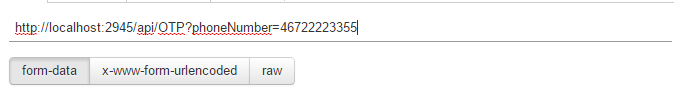

# Build your own Number verification and two authentication system c# .net
As you many websites and apps rely on knowing your phone number and in many cases using that number for two factor authentication (more info about TF2 here [https://www.sinch.com/opinion/what-is-two-factor-authentication/](https://www.sinch.com/opinion/what-is-two-factor-authentication/ "WHAT IS TWO FACTOR AUTHENTICATION?")). 
In this tutorial you will learn how to build your own two factor system in about 30 minutes. In part 2 we will implement it in one of our clients. 

Full sample code can be downloaded [here](https://github.com/sinch/net-two-factor-auth)
##Prerequisites 
1. Good understanding of c# and Rest apis
2. Visual Studio 2013 or later
3. Account with Sinch [http://sinch.com/signup](http://sinch.com/signup)

Optional a free [azure ](http://azure.com)account if you want to host it there. 

## Application flow
insert websequence diagram when they are up again 

## Create a project
Create a new WebApi project with no user authentication and if you have a azure account make sure the host in could box is checked.

## Install Sinch helper library 
When the project is created we want to add the Sinch.SMS nuget package we need to send out the OTP (One time password) codes with. Open up Package Manager Console 

'''csharp
pm>install-package Sinch.SMS
'''  


## Request One time password
When creating one time password first we need some where to store them, create a new class in the Models directory and call it OTPCode

```
public class OTPCode
{
    public string PhoneNumber { get; set; }
    public string Code { get; set; }
}
```
This class will contain all OTP (One Time password) request. In this tutorial we are only going to store them in memory, but in production you would probably have them in a memcache or database connected with your user. 

Create a new Empty WebAPI controller called **OTP** and add the below code

```
public class OTPController : ApiController
{
    private static List<OTPCode> OTPCodes = new List<OTPCode>();
    public async Task<HttpResponseMessage> RequestOTP(string phoneNumber)
    {
        // this method will issue new OTP codes 
    }

    public HttpResponseMessage VerifyOTP(string phoneNumber, string code)
    {
        //this method will verify code and number
    }
}
```

## Generating a random code
In this scenario, since it doesnt really matter that its totaly random and I dont care about threads I am just going to use a static Random (if you are interested in using a safer thread safe random in .net there many examples and one is [here](http://csharpindepth.com/Articles/Chapter12/Random.aspx) )

In **OTPController** add below declaration in the top of you class.  
```
private static Random rng = new Random();
```
In the **RequestOTP** method we now need to do the following 
1 seed a code
2 create new OPTCode object
3 Add the OTP code to the OTPCodes list 
4 Send an sms to the number submitted

```csharp
public async Task<HttpResponseMessage> RequestOTP(string phoneNumber)
{
    int value = rng.Next(100,9999); //1
    string code = value.ToString("0000");
    OTPCodes.Add(new OTPCode {PhoneNumber = phoneNumber, Code = code});//2 and 3
    
	//4 send an sms with the code
    try
    {
        // sms client will throw an error if something goes wrong 
		var message = string.Format("Your code:{0} for verifying your number with me", code);
		var number = phoneNumber.Trim();
		Client smsClient = new Client("key", "secret");
        await smsClient.SendSMS(number,message);
		return new HttpResponseMessage(HttpStatusCode.OK);
    }
    catch (Exception ex)
    {
        // handle error here, see https://www.sinch.com/docs/rest-apis/api-documentation/#messagingapi for possible errros
        return new HttpResponseMessage(HttpStatusCode.InternalServerError);
    }
}
```
In a production application you would most likely use the sinch to verify format of number before sending.

Also one thing yuu might want to add in a production app is to either wait to return until Sinch knows the message has been deliverd to the operator by using 
```csharp
smsClient.CheckStatus(messageid);
```

## Verifying codes
To verify the code, its as simple as when the the user enters the code in the client app you submit phonenumber and code and see if that entry exists inte the **OTPCodes**
```csharp
public HttpResponseMessage VerifyOTP(string phoneNumber, string code)
{
    if (OTPCodes.Any(otp => otp.PhoneNumber == phoneNumber && otp.Code == code))
    {
        return new HttpResponseMessage(HttpStatusCode.OK);
    }
    else
    {
        return new HttpResponseMessage(HttpStatusCode.NotFound);
    }
}

```

## Testig it out with postman 
I like to use postman for chrome to test out my restapis you can get it [here](https://www.google.se/url?sa=t&rct=j&q=&esrc=s&source=web&cd=1&cad=rja&uact=8&ved=0CCAQFjAA&url=https%3A%2F%2Fchrome.google.com%2Fwebstore%2Fdetail%2Fpostman-rest-client%2Ffdmmgilgnpjigdojojpjoooidkmcomcm%3Fhl%3Den&ei=1nbCVPyzBoXuyQOG-4K4DA&usg=AFQjCNHaecLwAKk91gpdCY_y1x_ViIrHwQ&bvm=bv.84349003,d.ZWU). Hit F5 to start the app locally make note of the port in my case it was 2945
head over to http://localhost:yourport/Help and you should see how to call our new api 

In postman generate and sms

And to verify code


## Next step
Next parts in this tutorial is going to cover how to use this in an native phone apps or websites. 
 